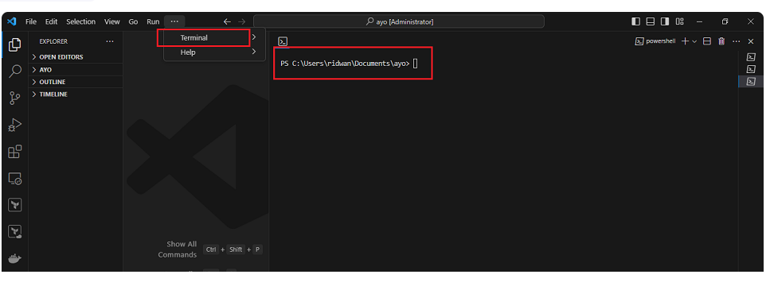
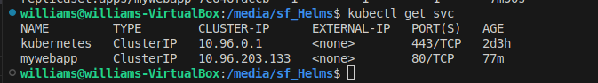

# INTRODUCTION TO HELM CHART
### Deploying a Web Application Using Helms in Kubernates
### Prerequisites
### Step-by-Step Implementation Plan
1. Verify Prerequisites

   We’ll confirm you have:

  - Minikube (or another Kubernetes setup)

- Helm installed

- Git installed

- Basic understanding of kubectl and Kubernetes resources

### 2. Set Up Your Environment

- Start your Kubernetes cluster (e.g., minikube start)

- Verify kubectl and Helm connectivity (kubectl get nodes, helm version)

### 3. Create a Sample Web Application

- Use a simple NGINX or Node.js app

- Containerize it with Docker

- Push it to Docker Hub or your local registry

### 4. Build a Helm Chart

- Create a Helm chart (helm create myapp)

- Modify values.yaml, deployment.yaml, and service.yaml

- Template the deployment using Helm’s templating system

### 5. Deploy Using Helm

- Install your app with Helm (helm install myapp ./myapp)

- Verify resources (kubectl get all)

### 6. Test and Access Your App

- Use minikube service myapp or a NodePort service to view the app in your browser

### 7. Integrate Helm with a Basic CI/CD Pipeline

- Create a GitHub Actions workflow that:

- Builds and pushes Docker images

- Deploys updates to the cluster using Helm
## Step 1: Install helm
## For Linus and macOsUsers
1. **Open your vscode**
   * Run Vscode as an administrator
   * Access CLI by opening the terminal
     
        
  
2. ### Download Helm
   
     * For linux, use `curl` to download helm

       ```
         curl -L https://get.helm.sh/helm-v3.5.0-linux-amd64.tar.gz -o helm.tar.gz
       ```

      *  For macOS use `curl` to download Helm :

          ```
             curl -L https://get.helm.sh/helm-v3.5.0-darwin-amd64.tar.gz -o helm.tar.gz
          ```

4.  ### Extract The Downloaded File

     ```
         tar -zxvf helm.tar.gz
      ```

5.  ### Move the Helm Binary
    * For **linux**

        ```
           mv linux-amd64/helm /usr/local/bin/helm 
        ```              
    
    * For **macOS**:

    ```       
      mv darwin-amd64/helm /usr/local/bin/helm
    ```                    
           
  7. ### Verify installation

        ```
        helm version
       ```    
 8. ### Clean Up

        
           rm helm.tar.gz && rm -r *-amd64
         
            
      
### For Windows:
  1. **Open Vscode**
       * Run vscode as administrator
       *Access Cli by opening the terminal
  2. **install helm**
      * install helm using **chocolatey**

        ```
          choco install kubernetes-helm
         ```
  3. **verify installation**
      * In poweshell or command prompt,run

        ```
          helm version
        ```
# Step 2 : Create a New Helm Chart    
   Now that we have helm installed in our enviroment,Lers create a new helm chart

1. ### Create Project Directory
       
      ```
         mkdir helm-web-app

         cd helm-web-app
     ```
2. ### Create a New Chart 
     
     ```
     helm create webapp
    ```
    This generates a structure like this:
    
    ```
      webapp/
    ├── Chart.yaml
    ├── values.yaml
    ├── charts/
    ├── templates/
    │    ├── deployment.yaml
    │    ├── service.yaml
    │   ├── _helpers.tpl
    │   ├── hpa.yaml
    │   └── ingress.yaml
   ```
### Step 3 — Customize the Chart

- Open values.yaml and modify these lines  
      
    ```
        replicaCount: 1

       image:
        repository: nginx
       pullPolicy: IfNotPresent
      tag: latest

      service:
      type: NodePort
      port: 80
     ```
### Step 4 — Deploy the App with Helm

   
    Check deployment status:
     
  ```
     kubectl get all
  ```   

### Step 8 — Access the Application

Find the NodePort:
  
  ```
      kubectl get svc
  ```
  

3. ### Initialize a git repository

     ```
        git init
        git add .
        git commit -m "Initial Helm webapp chart"
    ```
 4. ### Push to Remote Repository
    * Create a new repository in Github
    * Follow the instruction provided by Git services to push your local repository to remote

    ```
       git remote add origin <REMOTE_REPOSITORY_URL>
       git push -u origin master
    ```     

    
       
        
        
